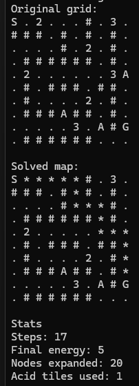

# C++ A* Pathfinding Project

## Overview
My A* Project is a little game that you can play with the algorithm given a map file for it to work with it will try find the best path to the end with an energy cost in mind. Each tile you move reduces your energy by 1 and you can gain energy in the map by the +2 and +3 tiles. The algorithm knows it cannot end with a negative energy so you must make a map that will work or you will be given an error. Example maps are below
## Features
This project features an A* algorithm with more that just a heuristic cost of making a move compared to another it needs to understand that it has an energy aswell and that energy is used to move around the board     

Maps are respresented as a grid of tiles loaded from .txt files       

The maps have multiple different tiles that affect movement or energy  
- '#' = Wall  
- . = Walkable tile  
- A = Acid (-5 energy)  
- 2 = +2 Energy Pickup  
- 3 = +3 Energy Pickup

After solving a map data is given back to the user like  
- The number of steps taken  
- Final Energy  
- Nodes expanded  
- Acid Tiles used

The project can also handle multiple maps at one time aswell  

## How It Works
Step 1 - Start Node  
The algorithm starts here at S with an energy of 20  
This node is placed in the open set 

Step 2 - Expand Start Node 
The algorithm explores neighbouring tiles
moving to a tile that is closest to the G(oal) while doing a calculation based off of the best possible move and the energy calculation is done 

Step 3 - Expand the Next Node
The algorithm searches for the best candidate node and explores its neightbours
The energy calculation is done and it gathers its new energy and updates nodes expanded

Step 4-Continue Exploring
The Algorithm continues expanding nodes and searching for possible paths while keeping in mind the best estimated distance to the goal 
Eventually it reaches the G(oal)

Step 5 - Path Reconstruction
Once the goal is reached and the algorithm has enough energy the algorithm traces back through the parent nodes and builds a map of what path it took
The path is then printed to the grid using *s as a path 




You can see clearly reconstructed path at the end with the *s adn the steps it took along with the final ending energy nodes expanded and the acid tiles it ran through

## File Structure

```text
CPPProjEW/
│
├── src/
│   ├── main.cpp
│   ├── AStar.cpp
│   └── Grid.cpp
│
├── include/
│   ├── AStar.h
│   ├── Grid.h
│   └── Position.h
│
├── maps/
│   ├── map1.txt
│   ├── map2.txt
│   └── map3.txt
│
├── CPPProjEW.vcxproj
├── CPPProjEW.vcxproj.filters
└── x64/
```

## Setup and Run
### Requirements
- Windows
- Visual Studio 2022 (or a compatible version)
- C++ Desktop Development workload installed

### Setup

1. Clone or download this repository.
2. Open the project in Visual Studio by opening the file `CPPProjEW.vcxproj`.
3. Ensure the build configuration is set to **x64**.

### Build and Run

1. Clean the project to remove any previous build files.  
   Build → Clean Solution

2. Build the project.  
   Build → Build Solution

3. Run the program.  
   Debug → Start Without Debugging

### Program Execution

When the program runs it will:

1. Load the map files (`map1.txt`, `map2.txt`, `map3.txt`)
2. Display the original grid
3. Run the energy-aware A* pathfinding algorithm
4. Print the solved grid with the discovered path marked using `*`
5. Output statistics including:
   - number of steps
   - final remaining energy
   - nodes expanded
   - acid tiles used

## Sample Maps
The programe comes preloaded with 3 maps of decent quality you can make some maps yourself but if you didnt want to then here are some sample maps for you to try

## Results

## Lessons Learned

## Future Improvements
